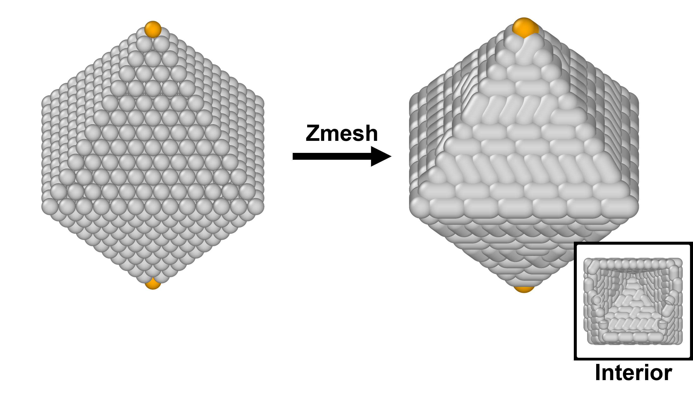

# Zmesh
Python scripts to mesh rigid bodies (nanoparticles) with polymer grafts for the Z1+ algorithm. These scripts create bonds between pairs of surface constituent atoms of rigid body based on the idea of Maximum Matching, and the final output is a processed LAMMPS data file ready for use in the Z1+ algorithm.

# Why should we mesh the rigid body (nanoparticle) for Z1+ algorithm?
We want to trick the algorithm to account for the presence of nanoparticles during the entanglement analysis by "meshing" the surface of the rigid bodies. This involves creating bonds between pairs of atoms, where each atom connects to only one other atom, forming dumbbells. These dumbbells represent the confining surfaces of the nanoparticles. Since Z1+ keeps the terminal beads of these dumbbells fixed, the rigid obstacles (nanoparticles) remain stationary throughout the analysis.  This ensures that the polymer chains are prevented from crossing into the rigid obstacles during the minimization process.

# Prerequisites

Before using the `Zmesh` scripts, make sure you have the following:

1. **Python 3.x**: The scripts are written in Python and require version 3.x or later.
2. **NetworkX Package**: This is essential for the `set_mesh_pair.py` script, which handles the meshing algorithm using graph theory. You can install it via pip: `pip install networkx`, or using Anaconda: `conda install anaconda::networkx`.
3. **Numpy**: useful python package. Do `pip install numpy` to install it or through Anaconda,
4. **LAMMPS** (optional): The input and output data are in LAMMPS format, so you need to be familiar with preparing LAMMPS data files. In the context of this package, you only need LAMMPS installed when you need the LAMMPS script here (explained below).

# How to use it?
1. Prepare a rigid body in LAMMPS data format (e.g., `rigid_body_no_polymer.data`) WITHOUT POLYMER. This will serve as a reference. If user only has data format with both polymer and rigid body, a LAMMPS script is provided to remove polymer (`delete.in.lmp`). 
2. Run `set_mesh_pair.py` (`python3 set_mesh_pair.py` in the terminal).
3. Prepare the MD simulation data file that you wish to mesh in LAMMPS data format (e.g., `simulation_example.data`), which consists of multiple rigid bodies and polymers. The data file can be generated in LAMMPS via command `write_data XYOUR_FILEX.data`
4. Identify a constituent atom in the reference data file from step (1) that will be used to establish connections in the MD simulation data. Document its ID and update the `min_ref_id` in the `mesh_NP_for_Z1.py` script accordingly.
5. Run `mesh_NP_for_Z1.py`  (`python3 mesh_NP_for_Z1.py --min_ref_id="YOUR_REF_ID"` in the terminal).

# Technical details
### What are types 3 and 5 in the `mesh_NP_for_Z1.py` script?
In this setup, rigid bodies are made up of atoms of types 3 and 5. Each rigid body contains two constituent atoms of type 5, and the atom with the smaller ID is used as a reference. instead of using atom type to find reference, users can also use the smallest ID in the rigid body as the reference by running `python3 mesh_NP_for_Z1.py --min_ref_id="YOUR_REF_ID" --do_selection_based_on_type=False`. 

### What is meant by "populating the connection"?
The scripts utilize the blossom algorithm (maximum matching) to pair constituent atoms, ensuring that (1) the distances between all pairs are minimized, and (2) all constituent atoms are paired. The next step is to broadcast this pairing relationship across all rigid bodies in a large-scale simulation. To do this, user should identify a characteristic atom/bead in a rigid body in `octa.data`. Then, the "relative pairing relationship" established in `set_mesh_pair.py` is converted into an absolute pairing relationship (i.e., bonds in the LAMMPS data file) by refering to that characteristic atom/bead.

### What is Z1+ algorithm?
[An awesome topological data analysis package for entangled polymer system](https://doi.org/10.1016/j.cpc.2022.108567).

### Why cleaving bonds between constituent atom and polymer?
For a polymer-grafted system, Zmesh will automatically remove the bond between the surface constituent atom and the polymer to prevent generating spurious statistics in Z1+. For instance, if we don't remove such a bond, Z1+ may mistakenly interpret a chain with beads N=5 grafted onto paired constituent atoms as N=7.
### what is polymer-grafted system and why do we care?
Polymer-grafted nanoparticle is an interesting system to study because they combine the mechanical properties / high processeibility of polymers and unique functionalities provided by nanoparticles.
### other assumptions made in this code
I assume each rigid body contains an even number of atoms, the interparticle distance between nearest constituent atoms is smaller than 1.5 $\sigma$ (b.c.s of FENE bonds), and that the atom ID pattern is consistent across all rigid bodies (i.e., the IDs of surface atoms were not randomized for different nanoparticles. I mean, who does that?)
